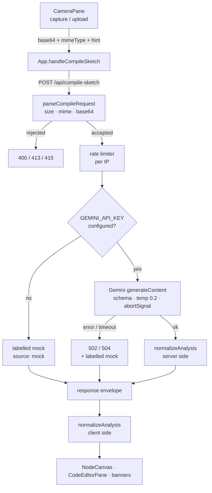

# Architecture

Design notes for Sketch2System — the parts that are non-obvious from reading the code,
and the reasoning behind them.

## Request flow



## The three boundaries

### 1. Request validation (`parseCompileRequest`)

Everything from the browser is untrusted. `imageBase64` must be a string of valid
base64 within the size ceiling; `mimeType` must be on an allowlist; `promptHint` must be
a string and is truncated. A non-string `imageBase64` previously reached `.replace()` and
produced a 500 with a leaked error message — it is now a clean 400.

### 2. Model output validation (`normalizeAnalysis`)

A `responseSchema` is a strong hint to the model, not a contract. `src/shared/validate.ts`
either throws or returns a fully-populated `SketchAnalysisResult`:

| Input problem | Handling |
| --- | --- |
| Duplicate or empty node ids | Node dropped |
| Edge referencing a non-existent node | Edge dropped — otherwise it renders as an arrow to nowhere |
| Missing or non-numeric `x`/`y` | Filled from `autoPosition(index)` |
| Unknown `type` / `style` / `status` | Coerced to a safe default |
| `confidence` outside 0–1 | Clamped |
| Duplicate edges | Deduplicated by `from->to` |
| Non-object payload | `ValidationError` |

It runs on **both** sides of the wire. The server guarantees its own response, and the
client refuses to trust the network.

### 3. Render sanitation

`sanitizeMermaid` strips `click`/`callback` directives, script-ish tags, `javascript:`
URLs, and inline event handlers. Mermaid then renders with `securityLevel: 'strict'`.
Both layers matter: the model output originates from an image an attacker could supply,
and the rendered SVG is injected with `dangerouslySetInnerHTML`.

## The canvas coordinate contract

The node graph is the one place where the model, the validator, and the renderer must
agree on numbers. `src/shared/graphLayout.ts` owns that agreement.

```
NODE_W = 208   // matches the `w-52` card class
NODE_H = 132   // card height is fixed so edge endpoints are exact
```

- The **layout engine** (`src/shared/autoLayout.ts`) computes every position.
- The **validator** fills in `autoPosition(index)` for any node without usable
  coordinates, so every node has a position downstream.
- The **canvas** absolutely positions each card at `(x, y)` inside an SVG coordinate
  space of the same dimensions.

### Why the model does not place nodes

The prompt used to demand exact pixel coordinates: `x` between 50 and 900, `y` between
50 and 400, with 260px horizontal and 190px vertical spacing to avoid overlap. Do the
arithmetic and that box holds **4 columns × 2 rows = 8 cards**. Every graph larger than
eight nodes was an impossible instruction, so the model crammed nodes on top of each
other and the edges vanished underneath them. A 13-node enterprise diagram was
unreadable.

No prompt wording fixes an arithmetically unsatisfiable constraint. The model is now
asked for **relative ordering only** — `x` for pipeline depth, `y` for vertical
grouping — which is the part it is genuinely good at, and `applyAutoLayout` computes
exact placement:

1. **Layering** — longest-path assignment. Nodes with no inbound edge start at layer 0;
   every other node sits one layer past its deepest predecessor, so edges flow
   consistently rightward. Nodes still unresolved after the Kahn sweep are in a cycle
   and are seated after whichever predecessors did resolve.
2. **Ordering within a layer** — seeded with the model's `y` ordering, then two
   barycenter passes (forward and backward) to reduce edge crossings.
3. **Coordinates** — fixed column and row gaps, with shorter columns centred against
   the tallest so the graph reads as a band.

Because spacing is arithmetic rather than a request, the result is overlap-free at any
node count. Verified end-to-end against the `test/` fixtures: the 13-node graph lays out
into 8 columns with zero card overlaps and zero label collisions.

`edgeGeometry` anchors each edge to the facing sides of the two cards:

```
goesRight = to.x >= from.x
x1 = goesRight ? from.x + NODE_W : from.x     // source edge
x2 = (goesRight ? to.x : to.x + NODE_W) ∓ 10  // target edge, minus arrowhead gap
y  = node.y + NODE_H / 2                      // vertical centre
```

Self-referencing edges get a loop instead of a zero-length line.

### Why two SVG layers

Edge **paths** render at `z-0`, behind the cards, so a line never crosses over a node.
Edge **labels** render in a second SVG at `z-20`, above the cards — drawn in the path
layer they were hidden behind adjacent nodes exactly when two nodes sat close together,
which is when the label matters most.

### Label placement

Putting labels above the cards solves *hidden* but creates *obscuring*: a label like
`Service Communication / Users Schema` is ~210px wide, while the corridor between two
adjacent cards is often under 100px, so at the path midpoint it covers the tech and port
rows of the cards on either side.

Ellipsizing to the corridor removes the overlap but destroys the text (`Service C…`).
So `labelPlacement` tries positions that are clear of the cards first, at full width:

1. on the line, at the path midpoint
2. lifted just above the taller card
3. dropped just below the lower card

Each candidate is tested against **every** card rather than just the two endpoints —
a third card sitting diagonally is precisely the case a two-node check misses (an edge
between two nodes on one row whose lifted label lands on a database card in the row
above). A candidate that would be clipped by the top of the canvas is skipped. Only if
all three collide does the label fall back to the midpoint, ellipsized to the corridor,
with the full text preserved in an SVG `<title>` tooltip.

Placement runs in sequence and each label also avoids every label already placed, so
parallel edges cannot stack their text on the same spot. Candidates slide along the edge
as well as off it, and there is a second tier above and below for dense fan-outs.

Across the bundled samples, a dense 4×2 grid with deliberately over-long labels, a
degenerate row flush against the canvas top, and both live 12- and 13-node fixtures,
this places every label at full length with zero card and zero label overlaps.

## Graph editing

The canvas is editable, not just a viewer. Nodes and edges live in `analysisResult`, so
every edit flows into the export and the `architecture.json` artifact.

| Action | How |
| --- | --- |
| Move a node | Drag it. Position commits on pointer-up. |
| Add a component | Toolbar `+`, or the button on the empty canvas |
| Delete | Select, then toolbar bin or <kbd>Delete</kbd> |
| Connect two nodes | Toolbar link icon, click source then target |
| Select / delete an edge | Click the line, then <kbd>Delete</kbd> |
| Rename | Edit the name field in the selection bar |
| Re-arrange | Toolbar grid icon re-runs the layered layout |
| Zoom | Buttons, or <kbd>Ctrl</kbd>/<kbd>⌘</kbd> + wheel |
| Full screen | Toolbar — hides the capture and editor panes |

Two details worth noting. While a node is being dragged it renders from local state and
only commits on pointer-up, so a pointermove does not round-trip through the parent on
every frame. And auto-fit is suppressed during a drag: the bounds shift as the node
moves, and refitting would rescale the canvas under the cursor.

Edge paths carry an invisible 14px-wide companion stroke purely for hit-testing — a 2px
line is far too thin to click reliably.

### Zoom, and why auto-fit must yield

Auto-fit and manual zoom form a feedback loop if auto-fit is allowed to run freely:

> zoom in → content grows → a scrollbar appears → the viewport's client size changes →
> `ResizeObserver` fires → auto-fit runs → **zoom snaps back to the fitted value**

Which reads to the user as "zooming does not work". The same loop can oscillate on its
own, because fitting shrinks the content, which removes the scrollbar, which grows the
viewport, which refits again.

Two rules break it. A `userZoomedRef` flag latches on the first manual zoom and stops
auto-fit from touching the level after that; auto-fit resumes only when the graph itself
changes or the user presses *Fit to view*. And `fitToView` ignores changes under 0.01,
so scrollbar-width feedback cannot ping-pong.

Auto-fit is also keyed on the **graph identity** (the node id list), not on the bounds —
bounds shift on every pointermove during a drag, which would refit continuously while
dragging.

Zoom is applied about an anchor — the cursor for <kbd>Ctrl</kbd>+wheel, the viewport
centre for the buttons — by converting the anchor to content space, rescaling, and
restoring scroll so the same point stays under it. Anchoring at the top-left corner
instead makes the graph lurch away from wherever the user is looking. Wheel steps are
multiplicative so a notch feels the same at 30% as at 300%.

### Flex sizing

`min-w-0` is applied down the whole flex chain (`main` → right pane → canvas root).
Without it, `min-width: auto` lets the canvas's intrinsic width propagate upward and
push `main` wider than the viewport. That clipped the right-hand nodes *and* made
fit-to-view measure an oversized viewport, so it computed a scale of 1.0 and never fit.
Fit-to-view constrains both axes and re-runs under a `ResizeObserver`.

## Honest degradation

Every analysis carries a source:

| `source` | Meaning | UI |
| --- | --- | --- |
| `gemini` | Really analyzed | Measured elapsed time; low-confidence warning under 70% |
| `mock` | Server could not analyze | Amber banner with the reason; confidence 0 |
| `sample` | Bundled example | Amber banner stating nothing was analyzed |

**Confidence and handwriting clarity are the model's own self-report about a sketch it
read.** With no sketch there is nothing to report, so both render as `N/A` unless
`source === 'gemini'` — the bundled sample ships a canned `0.96`, and displaying it as
`CONFIDENCE: 96%` implied a measurement that never happened. When it *is* measured,
anything under `LOW_CONFIDENCE_THRESHOLD` (0.7) raises a warning banner carrying the
model's retry suggestion. It is a self-assessment, not a calibrated probability, so it
is presented as a caution signal rather than a score to trust.

This is a deliberate design constraint: **a misconfigured or failing server must never
be indistinguishable from a working one.** The placeholder payload is built with
confidence 0 and a summary that says it is not a real analysis, and the client reports
real measured latency rather than a plausible-looking number.

The error path returns a non-2xx status *and* a fallback body. The client reads the body
regardless of status — an earlier version threw on `!response.ok` before reading, which
made the entire server-side fallback unreachable.

## Frontend state

`App.tsx` holds all shared state; components are presentational and controlled.

- `analysisResult` — always a validated `SketchAnalysisResult`
- `meta` — `{ source, reason, model, elapsedMs }`, drives the banners
- `editorTab` — shared by `SideNav` and `CodeEditorPane` so the sidebar genuinely
  navigates rather than writing to state nothing reads
- `selectedNode` — highlights the card and dims unrelated edges

Async work guards against stale results: the Mermaid renderer uses a monotonic sequence
id plus a cancellation flag so a slow render can never overwrite a newer diagram, and the
health fetch checks a `cancelled` flag before setting state.

## Media handling

The `<video>` element is **always mounted** and hidden with CSS when inactive.
Rendering it conditionally on camera state is a deadlock: the ref is null when the
stream resolves, so the stream never attaches and the camera never goes live. The
`MediaStream` is held in a ref and stopped on unmount and before every retry.

The camera is held **only while the live feed is on screen**:

```ts
const shouldStream = preview === null && !isCompiling;
```

Holding a captured still or waiting on a compile hides the video, so keeping the
stream open only kept the recording indicator lit and drained battery for a feed
nobody could see. Camera permission is remembered per origin, so resuming does not
re-prompt. Clearing the frame restarts the stream.

Capture is JPEG at quality 0.9 — a 1280×720 PNG is roughly ten times larger and pushes
against the 8 MB limit. The preview is **not** mirrored: this camera points at
handwriting, and a mirrored preview would not match the frame that gets captured.

## Export

`src/lib/zip.ts` is a minimal store-method ZIP writer (~120 lines, no compression), so
exporting real files costs no dependency. Text artifacts are small enough that skipping
deflate is free. UTF-8 filenames are flagged via bit 11 of the general-purpose flags.

## Known limitations

- The rate limiter is in-memory, so limits are per-instance.
- The graph has no manual node repositioning — layout comes from the model.
- Mermaid is a large bundle; the client chunk exceeds Vite's 500 kB warning. Code
  splitting the diagram renderer would be the obvious next optimization.
- There is no automated test suite. `npm run lint` is a strict `tsc --noEmit`.
